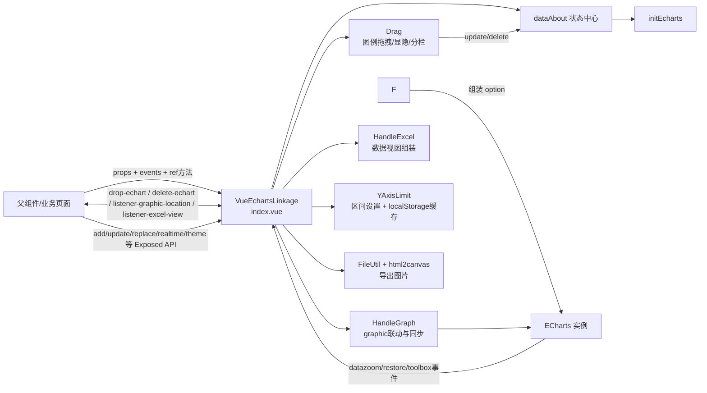
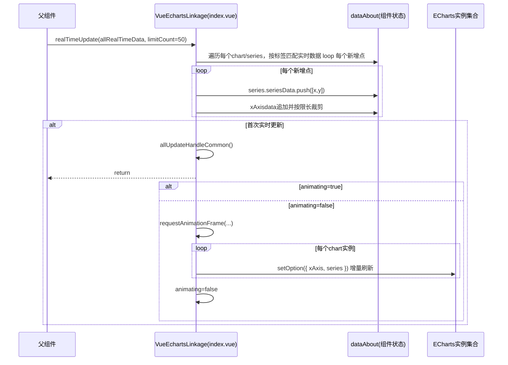

这个项目本质上是一个“多图联动 ECharts 组件库”，不是单一业务页面。它把多实例图表的渲染、联动、拖拽、导出、实时更新封装成一个 Vue 组件对外提供。

  参考：src/index.ts:4 vite.config.ts:56 package.json:2     

实现逻辑（核心链路）

  1. 组件维护统一状态 dataAbout（图表列表、分组、当前操作实例、主题、图形定位等），所有操作都落在这份状态上。 
    参考：index.vue:145                       
  2. initEcharts -> initOneEcharts 是主渲染流程：逐个图表构造 seriesOptionArray，再交给 EchartsLinkageModel 生成最终 option。 
    参考：index.vue:811 index.vue:691 model/index.ts:46                               
  3. EchartsLinkageModel 负责“单图配置编排”：图例、X/Y 轴、tooltip、visualMap、主题按钮、放大/缩小、语言、graphic 竖线等。 
    参考：model/index.ts:87 model/index.ts:213 model/index.ts:629                
  4. 联动分两层：                 
  - ECharts 原生联动（echarts.connect + 分组）
  - 自定义 graphic 联动（拖拽两条竖线、dataZoom 时同步位置） 
    参考：index.vue:835 extension.ts:110 handleGraph.ts:35
  5. 更新策略分为三类：       
  - 全量更新 updateAllEcharts
  - 轻量更新 updateSimpleEcharts（只改 xAxis/series）
  - 实时流式更新 realTimeUpdate（append + 限长） 
    参考：index.vue:1231 index.vue:1246 index.vue:1314
    
  6. 功能扩展比较完整：拖拽图例分栏、模板替换、主题切换、导图、Excel 数据视图、Y 轴区间缓存、自定义 tooltip/custom content。 
    参考：drag/index.vue:290 handleExcel.ts:175 yAxis store:10 index.vue:1428 它的作用
  - 快速搭建“多图同步分析面板”，减少你在业务侧重复写 ECharts 同步、交互、导出、拖拽逻辑的成本。
  - 提供统一 API（addEchart / updateAllEcharts / realTimeUpdate / replaceAllEchartsData 等）用于外部编排。 
    参考：types/index.ts:52

  应用场景

  - 工业/设备监控：多测点趋势联动缩放、报警区间着色、实时流数据。
  - 生产过程分析：多卷/多段“首尾拼接”趋势分析（项目里有 seriesLink 专门支持）。
  - 运维/IoT 看板：同时间轴多指标对比、局部放大查看、导出报表图片。
  - 质量追溯与诊断：按模板快速替换多图数据并保留交互布局。
    参考示例页：echarts-linkage-view.vue:82

  • flowchart LR “数据流/调用流”的简化架构图（从外部 API 到内部渲染管线）

  • 实时更新 (realTimeUpdate) 时序图
